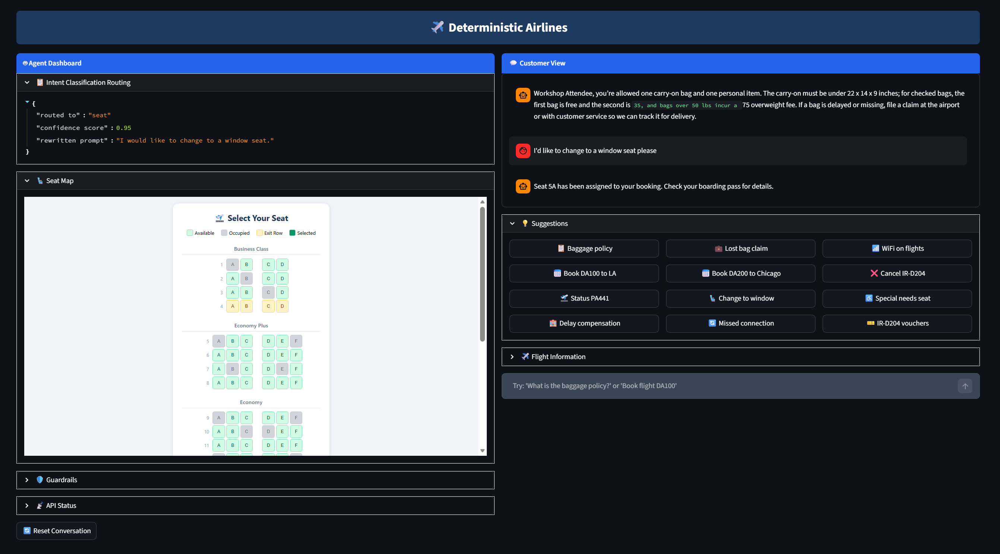

# Deterministic Airlines - Reference Solution

This repository contains a demo and a reference architecture focused on improving determinism in agentic AI applications.

It's part of a customer-based offering that helps AI technologists understand and implement established and emerging patterns and best practices that can be infused into agentic applications to improve accuracy, consistency, relevance, and coherence.

The application is composed of multiple parts:

1. **Backend**: A Python-based backend implemented with a single-agent architecture that encapsulates full agent orchestration logic and tool execution.

2. **Frontend**: A Python-based UI that provides customer-facing chat capabilities along with an agentic dashboard presenting backend telemetry.

## How to use

### 1) Create the Environment

In **VS Code**:

- Open the **Terminal**.
- Locate the `setup-environment.ps1` file in the project.
- Drag the file into the Terminal to insert its path.
- Press **Enter** to run the script.

> This script creates a Python virtual environment and installs all required Python dependencies for the project.

> Ensure the Terminal is running **PowerShell** before executing the script.

### 2) Add Azure Services

Open the `.env.example` file in the root directory.

- Rename the file to `.env`.
- In **Azure Foundry**, deploy the following models:
  - A **foundational model** (for example, `gpt-5x`) used for inference.
  - A **smaller model** (for example, `gpt-4.1-mini`) used for classification and summarization tasks.
- Deploy an **Application Insights** instance to capture application telemetry.

For each deployed service, collect the required connection details and add them to your `.env` file.

